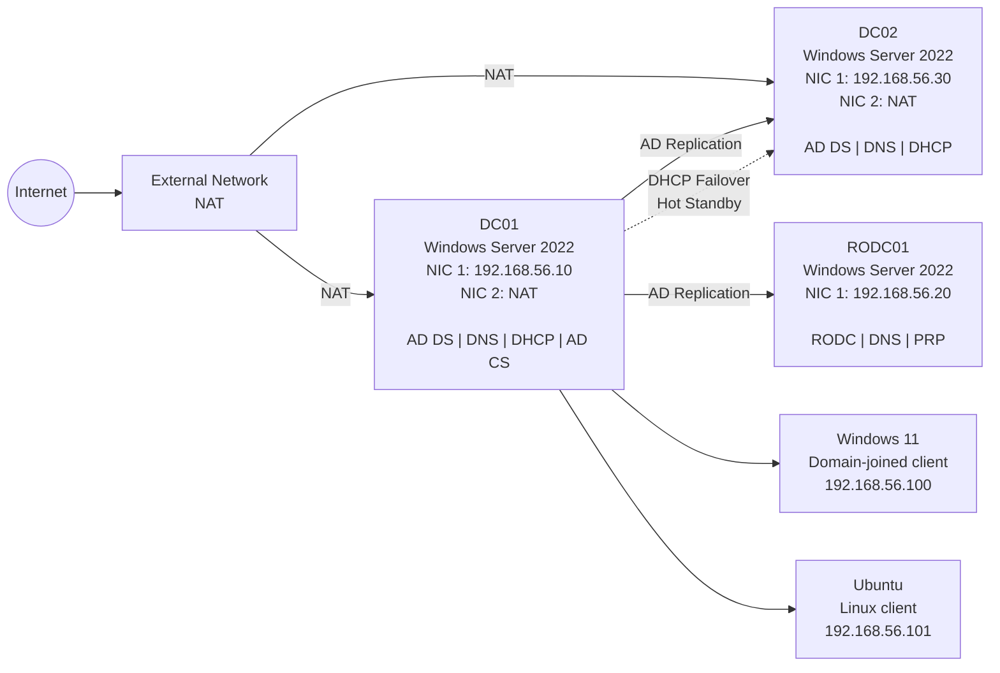
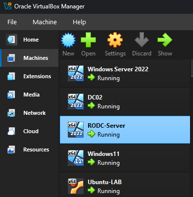
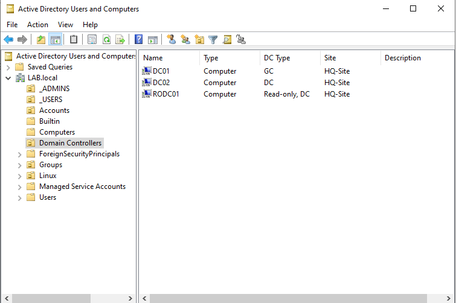
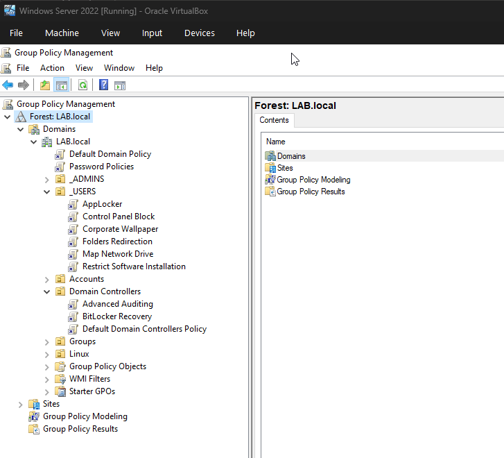
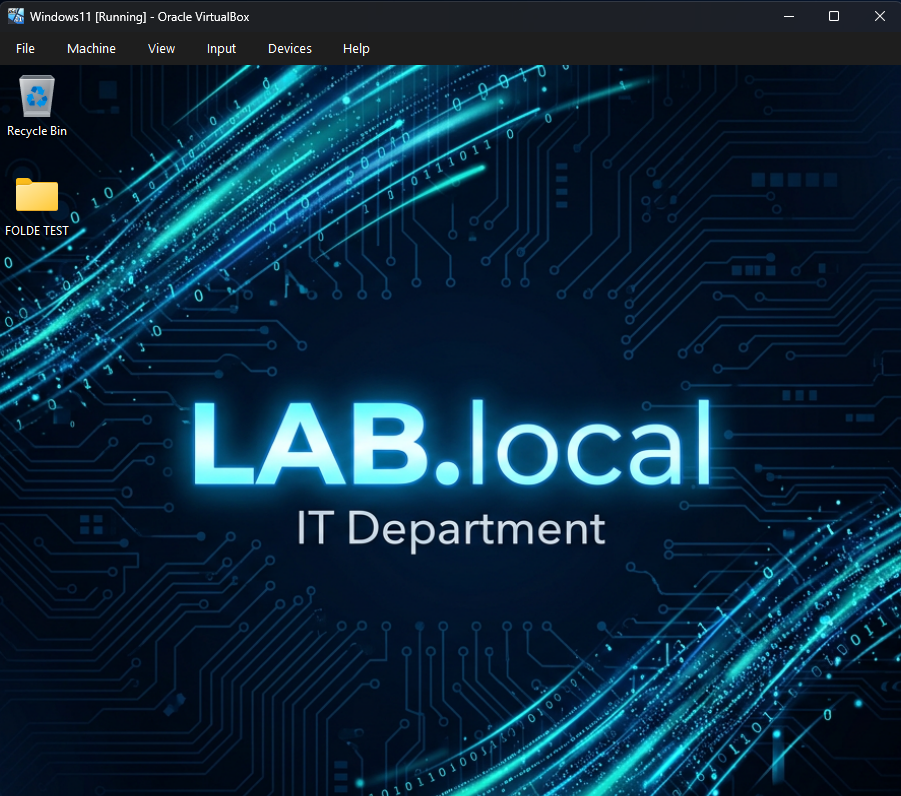

# 🌐 AD-LAB-V1
Personal Active Directory lab built with Oracle VirtualBox and Windows Server 2022.

This project demonstrates the deployment and management of an Active Directory domain environment, including multiple domain controllers, a Read-Only Domain Controller, DNS, DHCP, Group Policy Objects and domain-joined clients (Windows & Linux).

## Objectives

The main objectives of this project are:

- Deploy an Active Directory domain using Windows Server 2022.
- Configure DNS and DHCP services.
- Add a second domain controller for redundancy.
- Deploy and test a Read-Only Domain Controller (RODC).
- Join Windows 11 and Ubuntu virtual machines to the domain.
- Configure and validate Group Policy Objects.
- Configure DHCP Failover in Hot Standby mode.
- Document the architecture and validation procedures.

## Lab Environment

| Component | Details |
|---|---|
| Virtualization platform | Oracle VirtualBox |
| Domain | LAB.local |
| Network | 192.168.56.0/24 |
| Main server | DC01 – Windows Server 2022 |
| Secondary server | DC02 – Windows Server 2022 |
| Read-only controller | RODC01 – Windows Server 2022 |
| Windows client | Windows 11 |
| Linux client | Ubuntu |

## Architecture

The following diagram shows the VirtualBox network topology and the main services deployed in the lab.

### Mermaid Diagram

## Infrastructure

### DC01

DC01 is the primary domain controller and provides the following services:

- Active Directory Domain Services
- DNS
- DHCP
- Active Directory Certificate Services
- Internet access through a NAT adapter

### DC02

DC02 is the secondary domain controller and provides redundancy for the domain environment:

- Active Directory Domain Services
- DNS
- DHCP
- Active Directory replication with DC01
- DHCP Failover in Hot Standby mode

### RODC01

RODC01 is a Read-Only Domain Controller configured with:

- Read-only Active Directory database
- DNS
- Password Replication Policy
- Internal network connectivity only

## Group Policy Objects

This lab includes 11 Group Policy Objects: 9 custom GPOs designed to enforce security, restrictions, and user experience standards + 2 default Active Directory GPOs.

| GPO Name | Scope (Linked OU) | Description |
|---|---|---|
| Advanced Auditing | LAB.local/Domain Controllers | Enables advanced security auditing on domain controllers, tracking logon events, account management, policy changes, and object access for compliance and incident investigation purposes. |
| AppLocker | LAB.local/_USERS | Enforces application whitelisting through AppLocker, restricting execution of unauthorized software and reducing the attack surface across domain-joined workstations. |
| BitLocker Recovery | LAB.local/Domain Controllers | Enforces AD DS-based recovery for BitLocker-protected drives, ensuring recovery passwords and key packages are backed up to Active Directory before encryption is permitted. |
| Control Panel Block | LAB.local/_USERS | Restricts standard users from accessing Control Panel and PC settings, preventing unauthorized changes to system configuration. |
| Corporate Wallpaper | LAB.local/_USERS | Deploys a standardized desktop wallpaper via the NETLOGON share, applied to all authenticated users regardless of workstation, ensuring consistent corporate branding and preventing user-side modification. |
| Folders Redirection | LAB.local/_USERS | Redirects user profile folders (Desktop, Documents) to a centralized network location, ensuring data persistence independent of the local machine. |
| Map Network Drive | LAB.local/_USERS | Automatically maps a network drive at logon, providing users with consistent access to shared resources without manual configuration. |
| Password Policies | LAB.local | Enforces domain-wide password complexity, minimum length, expiration, and account lockout thresholds to strengthen credential security. |
| Restrict Software Installation | LAB.local/_USERS | Prevents standard users from installing unauthorized software, reducing the risk of malware introduction and maintaining endpoint compliance. |

### Default GPOs

| GPO Name | Scope (Linked OU) | Description |
|---|---|---|
| Default Domain Policy | LAB.local | Baseline domain-wide policy automatically created by Active Directory, defining core password, lockout, and Kerberos authentication settings. |
| Default Domain Controllers Policy | LAB.local/Domain Controllers | Baseline security policy automatically applied to domain controllers, governing user rights assignment and default audit behavior. |

## Validation

The lab environment was tested to confirm that core services and policies behave as expected:

- Group Policy application verified on domain-joined clients using `gpupdate /force` and `gpresult /r`.
- DNS resolution tested for internal domain records and forward/reverse lookup zones using `nslookup` and `Resolve-DnsName`.
- DHCP Failover in Hot Standby mode validated between DC01 and DC02, confirming lease synchronization and automatic failover.
- Active Directory replication verified between DC01, DC02, and RODC01 using `repadmin /replsummary` and `repadmin /showrepl`.

> Full step-by-step validation procedures, command outputs, and screenshots are available in the full project documentation.

## Tech Stack

Windows Server 2022 · Windows 11 · Ubuntu · Active Directory Domain Services (AD DS) · DNS · DHCP · Group Policy Objects (GPO) · Read-Only Domain Controller (RODC) · Oracle VirtualBox

## Full Documentation

Detailed configuration steps, screenshots, and validation results are available in the full project documentation:

📄 

## Screenshots
Selected screenshots from the lab environment. Detailed configuration screenshots and validation evidence are available in the full project documentation.

### VirtualBox Lab Environment

VirtualBox Manager displaying the domain controllers and domain-joined client machines used in the lab.

### Active Directory Users and Computers

Active Directory Users and Computers showing the domain controllers, including the Read-Only Domain Controller.

### Group Policy Management

Group Policy Management displaying the configured domain and security-related Group Policy Objects.

### Windows 11 Domain-Joined Client

Windows 11 domain-joined client displaying the corporate wallpaper applied through Group Policy.

## Author

**M. El Majdoul**
